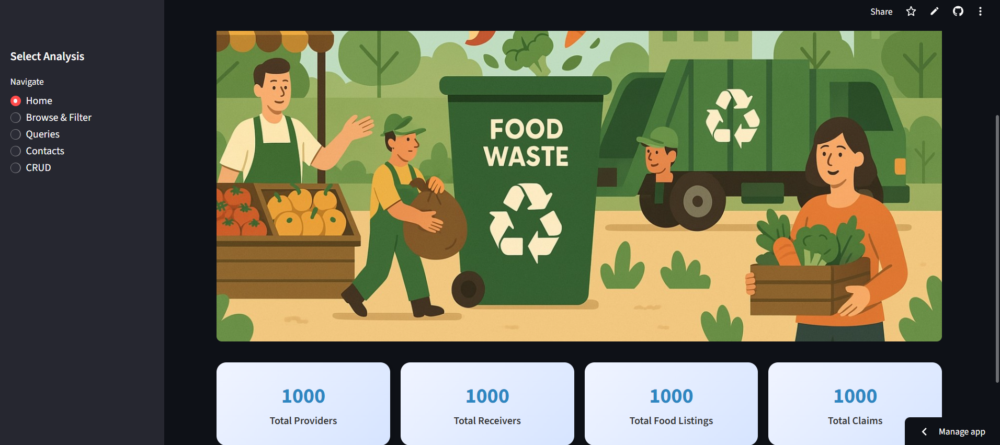

# ♻️ Food Wastage Management System

A Streamlit web application designed to **reduce food wastage** by connecting **food providers** (restaurants, Grocery Stores etc) with **receivers** in need.  
The platform enables **real-time donations**, **data insights**, and **efficient distribution** through a clean and interactive dashboard.

---

## 🚀 Features

✅ **Dashboard Overview** – Quick KPIs for total providers, receivers, food listings, and claims  
✅ **Browse & Filter** – Filter donations by city, provider, or food type  
✅ **Data Cleaning** – Ensures vegetarian, vegan, and non-veg categories show only relevant items  
✅ **Queries & Insights** – Prebuilt queries to explore top providers, popular food types, demand by city, and wastage trends  
✅ **Contacts Section** – Directly email or call providers & receivers with clickable links  
✅ **CRUD Operations** – Add, update, or delete records from the database (providers, receivers, food, claims)  

---

## 🖼️ Project Demo

  
 

---

## 📊 Dashboard Preview

- 👨‍🍳 **Providers** count  
- 🤝 **Receivers** count  
- 🍲 **Food Listings** count  
- 📦 **Claims** count  

---

## 🛠️ Tech Stack

- **Frontend:** [Streamlit](https://labmentixinternship-localfoodmanagment.streamlit.app/) 
- **Database:** SQLite3  
- **Libraries:** Pandas, Plotly, PIL, Datetime  

---

## 🔍 Example Insights (Queries)

📌 Most frequent food providers and their contributions
📌 Highest demand cities based on claims
📌 Food wastage trends over time
📌 Popular food types & meal preferences

## 📈 Future Enhancements

✨ Geolocation-based matching → Connect nearby providers & receivers
✨ Mobile notifications → Real-time updates on available food
✨ AI-driven prediction models → Detect wastage patterns & optimize allocation

