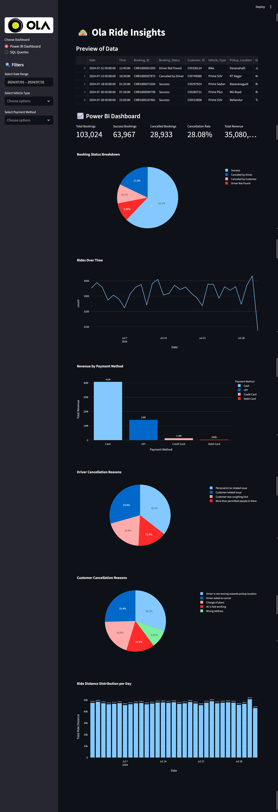

# 🚖 Ola Ride Insights – Data Analytics Project  

## 📌 Project Overview  
This project analyzes **Ola ride booking data** to uncover insights into **bookings, cancellations, revenue, and ratings**.  

Using **SQL, Power BI, and Streamlit**, I transformed raw data into **business intelligence dashboards** and **interactive applications** that provide valuable decision-making support.  

---

## 🔍 Objectives  
- Perform **EDA** to identify booking and cancellation trends.  
- Highlight **top customers**, **cancellation reasons**, and **ride patterns**.  
- Measure **vehicle-wise performance** and **payment method usage**.  
- Compare **customer vs driver ratings** for satisfaction analysis.  
- Build an **interactive Streamlit app** for real-time SQL queries and dashboards.  

---

## 🛠 Tech Stack  
- **Python** → Pandas, Plotly, Streamlit  
- **SQL** → MySQL / SQLite  
- **Power BI** → KPI cards & dashboards  
- **Data Cleaning & EDA**  

---

## 📊 Power BI Dashboard  
### Key Metrics  
- Total Bookings: **103,024**  
- Successful Bookings: **63,967**  
- Cancelled Bookings: **28,933**  
- Cancellation Rate: **28.08%**  
- Total Revenue: **₹35M+**  

### Visual Insights  
- **Booking Status Breakdown (Pie Chart):** 62% success vs 28% cancellations.  
- **Rides Over Time (Line Chart):** Weekday demand peaks reflect office commute trends.  
- **Revenue by Payment Method (Bar Chart):** UPI & Cash dominate transactions.  
- **Ratings by Vehicle Type (Grouped Bar):** Premium rides rated higher than budget rides.  
- **Cancellation Reasons (Pie Charts):** Customers → change of plans; Drivers → personal/car issues.  
- **Ride Distance Distribution (Bar Chart):** Premium rides cover longer distances, budget rides short commutes.

### 📷 Dashboard Screenshot  
 

---

## 💻 Streamlit Application  
The app has two modes:  

1. **Dashboard Mode** – KPIs and charts with filters for date, vehicle type, payment, and status.  
2. **SQL Explorer** – Dropdown to run predefined SQL queries and preview results dynamically.

### 📷 Dashboard Screenshot  
) <!-- Replace with actual screenshot path -->

