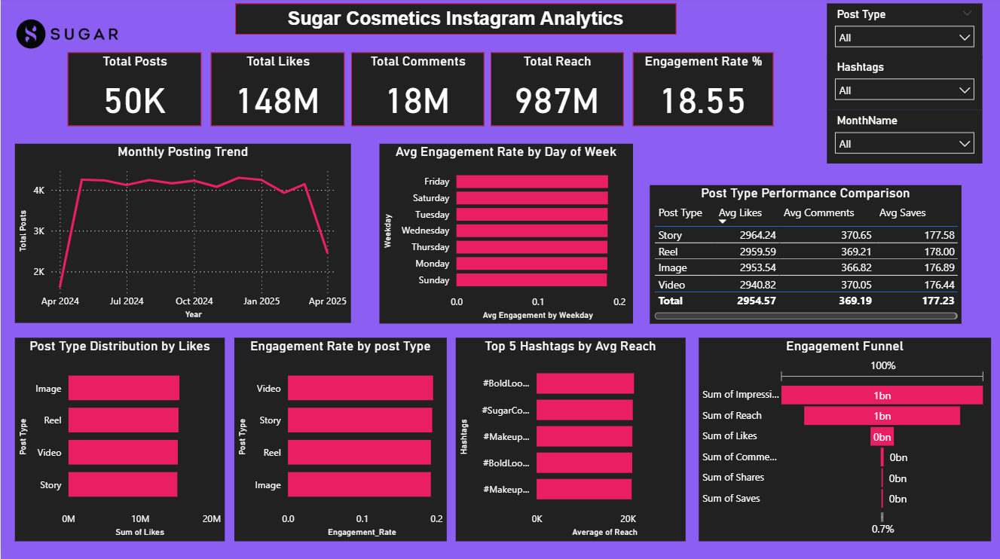

# 📊 Sugar Cosmetics Instagram Insights Dashboard

## 📌 Project Overview
This project analyzes Sugar Cosmetics’ Instagram performance by transforming raw social media metrics into actionable insights.  
The interactive **Power BI dashboard** highlights posting trends, audience behaviors, and engagement effectiveness, empowering the marketing team to make smarter, data‑driven decisions.

---

## 🚀 Key Features
- **KPI Cards** – Impressions, Reach, Likes, Comments, Shares, Saves  
- **Monthly Posting Trend** – Track posting consistency and campaign spikes  
- **Engagement Funnel** – Visualize drop‑offs from reach to deeper interactions  
- **Hashtag & Content Analysis** – Identify drivers of engagement  
- **Branded Theme** – Dashboard styled in Sugar Cosmetics’ brand palette  

---

## ✅ Skills Demonstrated
- 🧹 Data Cleaning & Preparation – Structured Instagram Insights data for accuracy  
- 📊 Exploratory Data Analysis (EDA) – Posting frequency, hashtag performance, engagement drivers  
- 📈 Power BI Dashboard Design – Interactive visuals, slicers, and branded storytelling  
- 🤖 Analytical Storytelling – Converted metrics into clear recommendations for marketing strategy  

---

## 📈 Business Impact
- 🔹 Track posting consistency and campaign effectiveness  
- 🔹 Highlight engagement gaps and optimize content formats  
- 🔹 Provide stakeholder‑ready visuals for smarter decisions  
- 🔹 Strengthen brand loyalty through data‑driven campaigns  

---

## 💡 Tech Stack
- Power BI  
- Data Visualization  
- Social Media Analytics  

---

## 📷 Dashboard Preview

---

## 🏆 Conclusion
This project reflects the power of combining **data analytics with creative storytelling**.  
By placing analytics at the core of strategy, Sugar Cosmetics can evolve from strong visibility to deeper engagement, smarter campaigns, and sustained leadership in the beauty industry on social media.
